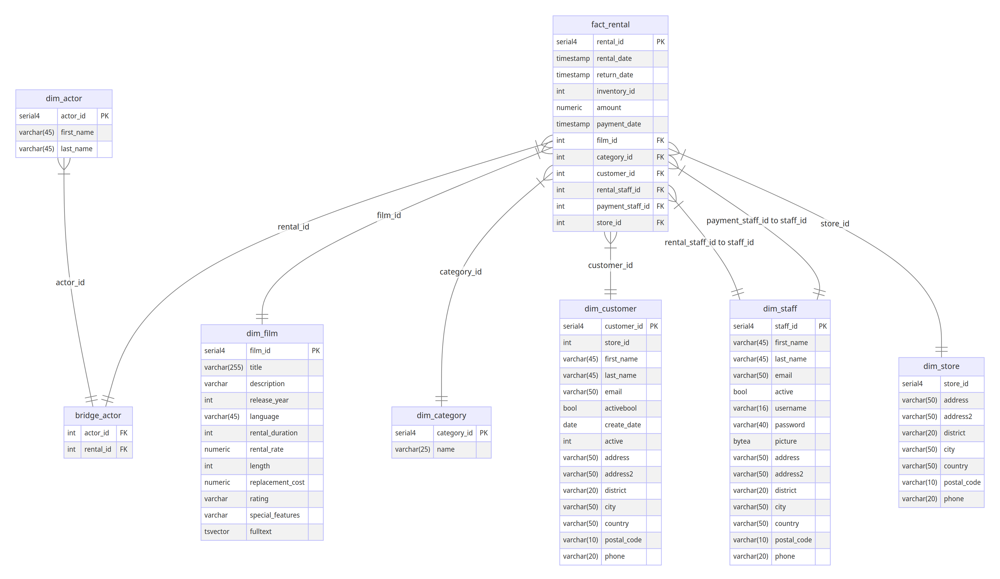

# Advanced SQL Practices: DVD Rental Analysis

## Overview

This project demonstrates the application of advanced SQL techniques to solve practical business questions using a sample DVD rental database (based on the MySQL Sakila sample database). The primary goal is to showcase proficiency in complex SQL querying, data manipulation, and analytical thinking relevant to Data Analyst, Data Engineer, and Business Intelligence roles.

The analysis focuses on extracting meaningful insights from rental transactions, customer behavior, film inventory, and store performance data.

## Skills Demonstrated

This project highlights expertise in various advanced SQL concepts, including:

* **Complex Joins:** Combining data from multiple tables in a star schema (INNER JOIN).
* **Common Table Expressions (CTEs):** Structuring complex queries for readability and modularity.
* **Subqueries:** Nesting queries for multi-step data filtering and calculations.
* **Window Functions:**
    * `RANK()` / `ROW_NUMBER()`: Ranking data within partitions (e.g., top films per rating, top actors).
    * `LAG()` / `LEAD()`: Comparing data across rows (e.g., month-over-month analysis).
    * Aggregate Window Functions: Performing calculations across specific windows without collapsing rows.
* **Conditional Logic:** Using `CASE` statements for data categorization and conditional aggregation.
* **Data Aggregation:** Employing functions like `SUM()`, `COUNT()`, `AVG()`, `MAX()` with `GROUP BY`.
* **Date/Time Functions:** Extracting components (`EXTRACT`), calculating differences (`TIMEDIFF`), and filtering based on specific time windows (`BETWEEN`).
* **String Manipulation:** Using functions like `CONCAT()` and `SUBSTRING()`.
* **Pivoting Data:** Transforming data from rows to columns using `CASE` statements within aggregate functions.
* **Data Filtering:** Advanced `WHERE` clause usage with `IN`, `BETWEEN`, `IS NOT NULL`, and logical operators (`AND`, `OR`).

## Dataset

The project utilizes a modified version of the **Sakila Sample Database**, representing a fictional DVD rental company named "Rentio". It follows a star schema, optimized for analytical queries.

**Key Tables:**

* `fact_rental`: Central fact table containing rental transaction details and foreign keys.
* `dim_film`: Dimension table with film attributes (title, rating, category, etc.).
* `dim_customer`: Dimension table with customer details.
* `dim_store`: Dimension table with store information.
* `dim_category`: Dimension table for film genres.
* `dim_actor`: Dimension table for actors.
* `dim_staff`: Dimension table for staff members.
* `bridge_actor`: Bridge table connecting actors to rentals/films.

**Database Schema:**



## Project Structure

.
├── images/
│   └── star_schema_erd.png  # Database schema diagram
├── src/
│   └── env                  # Environment variable configuration (template or actual)
├── .env                     # Main environment file (if not in src/) - Add to .gitignore!
├── Advanced SQL.ipynb   # Jupyter Notebook with analysis and queries
└── README.md                # This file

## Setup and Usage

To run the analysis presented in the Jupyter Notebook, follow these steps:

1.  **Prerequisites:**
    * Python 3.x installed.
    * Access to a MySQL database instance.
    * Jupyter Notebook or JupyterLab environment.

2.  **Database Setup:**
    * Download and import the Sakila sample database schema and data into your MySQL instance. You can find resources online (e.g., [Official MySQL Documentation](https://dev.mysql.com/doc/sakila/en/)). Ensure the database name matches the one specified in your configuration.
    * *(If you used a modified version, provide instructions or the SQL script to create it).*

3.  **Clone Repository:**
    ```bash
    git clone <your-repository-url>
    cd <repository-directory>
    ```

4.  **Install Dependencies:**
    * It's recommended to use a virtual environment.
    ```bash
    python -m venv venv
    source venv/bin/activate  # On Windows use `venv\Scripts\activate`
    ```
    * Install required Python packages:
    ```bash
    pip install ipython-sql pymysql python-dotenv jupyterlab pandas # Add other dependencies if used
    ```
    * *(Consider adding a `requirements.txt` file for easier installation: `pip install -r requirements.txt`)*

5.  **Configure Environment Variables:**
    * Create a `.env` file in the root directory (or `src/` depending on your notebook code). **Important:** Add `.env` to your `.gitignore` file to avoid committing credentials.
    * Add your database connection details to the `.env` file:
      ```env
      DBHOST=your_database_host (e.g., localhost or an IP)
      DBPORT=your_database_port (e.g., 3306)
      DBNAME=sakila # Or your specific database name
      DBUSER=your_database_username
      DBPASSWORD=your_database_password
      ```

6.  **Run the Notebook:**
    * Start JupyterLab or Jupyter Notebook:
      ```bash
      jupyter lab
      # or
      jupyter notebook
      ```
    * Open the `C3_W3_Assignment.ipynb` file.
    * Execute the cells sequentially to connect to the database and run the SQL queries. The notebook connects using the credentials from the `.env` file and utilizes the `ipython-sql` magic commands.

## Business Questions & SQL Queries

The core of this project is presented within the `C3_W3_Assignment.ipynb` notebook. It is structured around specific business questions relevant to the DVD rental business. Each section outlines:

1.  The **Business Question** being addressed.
2.  The **Context** or reason why the question is relevant.
3.  The **Advanced SQL Query** used to answer the question, often demonstrating one or more of the techniques listed under "Skills Demonstrated".
4.  The **Expected Output** or result of the query.

Please refer to the notebook for the detailed implementation and results.
